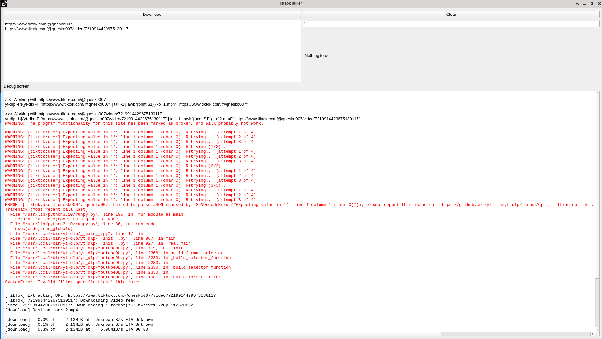

# tiktok-puller
Дана програма стане в нагоді аутистам, які качають багато відео з ТікТока.

# Залежності
- Python3 з бібліотекою PyQt5.
- yt-dlp

## Принцип роботи
У центрі самої програми закладено [yt-dlp](https://github.com/yt-dlp/yt-dlp), тому якщо в системі вона відсутня або не знаходиться в `$PATH`, то це варто виправити.

Користувач має надати список посилань на відео в ТікТоці, крізь які пройде `yt-dlp` і потягне найліпшу якість. Останнє робиться наступною командою:
```
yt-dlp -f $(yt-dlp -F "${посилання}" | tail -1 | awk '{print $1}') -o "<номер файла>.mp4" "${посилання}"
```

Всі відео завантажуватимуться у одразу кількох потоках, яких у програмі прописано 1000. У Qt5/Пітона є свій механізм для обмеження їх кількості, тож навіть якщо користувач надав тисячу і одне посилання одразу його срака разом з комп'ютером не лусне.

На даний момент програма робить усі кнопки непрацюючими поки хоча б один потік запущено і він виконує свою роботу. Також вона вміє розрізняти повідомлення з помилками і змінювати колір у логах відповідним чином.


Кнопка Clear використовується для очистки всіх полів окрім того, що з порядковим номером файлів.

Якщо не подобається іконка програми, її завжди можна змінити руками. Для цього треба видалити поточну іконку (icon.png) і назвати файл з новою icon.png. Програма розраховує, що іконка знаходиться у тій самій папці, що й скрипт Пітона.

**ВАЖЛИВО:** tiktok-puller розроблялася та тестувалася на Лінукс; для запуску команд використовується синтаксис Баша, а тому вона не працюватиме на Віндовс без додаткових змін.

## TODO
- Підтримка Віндовс.
- Переоцінка роботи: замість блоку кнопок під час запуску тредів блокувати тільки при натисканні Clear, коли потоки ще активні.
- Оформити генерацію списку посилань на всі відео, якщо в списку цілей є лише посилання на обліковий запис.

